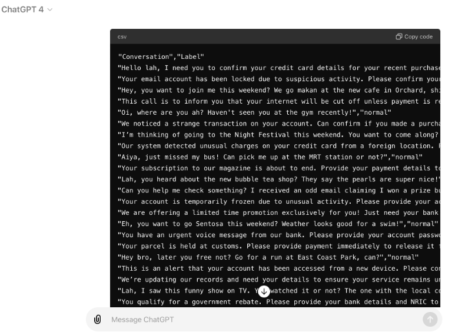
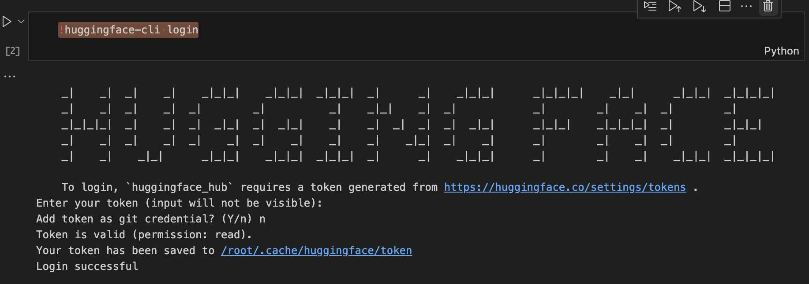

# Scam-detection-model
The project compares performance of different machine learning models to perform binary classification of phone call content to identify whether it is a "scam" or "normal" conversation. 

## Dataset
The dataset consist of one feature which is the conversation and the output with label either "fraud" or "normal". To help detect phone scam targeted at Singapore, conversations were generated with Generative AI tools that will add everday conversations in Singapore. All the data is combined on a single *ScamDataset.csv* file.

Source:
- https://www.kaggle.com/datasets/narayanyadav/fraud-call-india-dataset
- https://www.kaggle.com/datasets/uciml/sms-spam-collection-dataset
- https://github.com/wspr-ncsu/robocall-audio-dataset/blob/main/metadata.csv
- https://huggingface.co/datasets/alissonpadua/ham-spam-scam-toxic

Generated data:


## Setup
### Prerequirsite
Python Jupyter Notebook was used to develop the code to evaluate the different model. This model can be run on a cloud environment service like Google CoLab or run on a local environment with a NVIDEA CUDA supported GPU.

1. Install the python liberies

``` 
    pip install -r requirements.txt
```

(For running on local environment, make sure NVIDEA's cuda toolkit and cuDNN library is installed if your machine has a NVIDEA GPU.)

2. For training and evaluating models (Naive bayes, SVM, Random Forest, Logistic Regression, LSTM)

Run conventional-models.ipynb

3. For training and evaluating models (Bert, RoBERTa and DistilBERT)

Run transformer_models.ipynb

4. For training and evaluating models (GPT2 and Llama 3)

- Run gpt2Model.ipynb
- Run llama3_Fine_Tuning.ipynb

# llama 3 verification
The use of llama 3 model would require to seek approval at Huggingface website. You are required to create an Huggingface account, fill out a form at https://huggingface.co/meta-llama/Meta-Llama-3-8B. (It should take about 1-2 working days). Next, generate an access token at the Huggingface website.

Profile -> Settings -> Access Tokens -> New Tokens

Next run the llama3_Fine_Tuning.ipynb code and when the code runs "!huggingface-cli login", it will prompt for the access token. Copy and paste the access token and press enter. 
(This step can be done on a seperate terminal. Run *huggingface-cli login*)




# Results

## Conventional Models


## Transformer Models


## Large Language Model

### Before fine-tuned
#### GPT-2


#### Llama-3


### After fine-tuned
#### GPT-2


#### Llama-3


